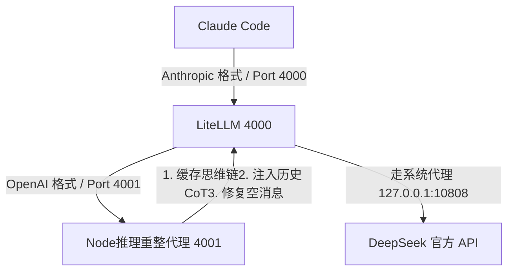

# 🧠 Claude Code 接入 DeepSeek 推理修复网关 (Claude Code DeepSeek Reasoning Proxy)

这是一个为 **Claude Code (CC)** 接入 **DeepSeek (V3/R1)** 推理模型量身定制的本地双层代理网关方案。

它完美解决了以下三大核心痛点：

1. **API Error 400 格式报错**：拦截并修复了多轮工具调用后，由于 Assistant 消息 `content` 和 `tool_calls` 双为空而导致 DeepSeek API 抛出 `Invalid assistant message` 的硬伤。
2. **国内网络连通性 (Socket Hang Up)**：在 Python/LiteLLM 层集成了系统代理自适应逻辑，保证国内网络环境下与 `api.deepseek.com` 的稳定连接。
3. **多轮思维链 (Reasoning Content) 丢失**：支持流式思维链字符的本地缓存，并在后续多轮对话中动态将 `reasoning_content` 注入历史上下文，防止推理模型在多轮交互中报错或“失智”。

---

## 📐 运行架构 (Architecture)

本方案采用 **Node.js 历史重整代理 + LiteLLM 协议适配代理** 的双层架构设计：



---

## ✨ 项目特性 (Features)

- **零依赖 Node 代理**：[deepseek_reasoning_proxy.js](deepseek_reasoning_proxy.js) 使用 Node.js 原生标准库编写，无需运行 `npm install` 安装任何多余的三方依赖。
- **一键环境启动**：双击运行 `start-services.bat` 即可全自动读取配置并隐藏启动后台服务。
- **本地沙盒隔离**：配置有 `start-claude.bat`，自动将 Claude Code 的本地历史和配置文件重定向至项目根目录下的 `claudecode/` 中，不污染系统 C 盘。
- **多端共享通用**：本地端口可以直接复用于 **Cursor**、**VS Code (Cline / Roo Code / Continue)** 等支持自定义 OpenAI 接口地址的 AI 编程插件。

---

## 🚀 快速上手 (Quick Start)

### 1. 克隆项目与安装依赖

确保您的系统已安装了 **Node.js** 和 **Python 3**。

```powershell
git clone <your-repo-url>
cd claude-code-deepseek-proxy
pip install "litellm[proxy]"
```

### 2. 一键配置并启动服务

1. 双击运行项目根目录下的 **`start-services.bat`**。
2. **首次运行引导**：终端会提示您输入 DeepSeek API Key：
  `Please enter your DEEPSEEK_API_KEY: `
  粘贴您自己的 DeepSeek 密钥，按回车即可。脚本会自动在本地创建 `.env` 文件保存它。
3. **自动代理检测**：脚本会自动读取 Windows 系统的注册表设置，获取您当前的科学上网软件代理端口（如 Clash 的 `7890` 或 v2rayN 的 `10808`），并在内存中自动配置 `HTTP_PROXY` 与 `HTTPS_PROXY`。

服务启动后，会在后台拉起：

- **Port 4000**: LiteLLM 协议转换网关（处理外网代理连接）
- **Port 4001**: Node.js 推理重整网关（拦截格式报错、缓存流式思维链）

### 4. 运行 Claude Code

双击运行项目根目录下的 **`start-claude.bat`**。该脚本会自动设置本地代理端口并将数据文件重定向在当前目录下，随即拉起 `claude`：

```powershell
# 或者在当前目录下直接通过命令行启动：
.\start-claude.bat
```

---

## 🛠️ 高级技巧：配置 PowerShell `cc` 全自动无感启动

为了在任何工作目录下敲击 `cc` 都能自动检测并后台启动代理服务，推荐将以下函数写入您的 PowerShell 配置文件 `$PROFILE` 中：

1. 在 PowerShell 终端输入：`notepad $PROFILE`
2. 将以下内容粘贴进去并保存（注意修改 `E:\claude-code-deepseek-proxy` 为您实际克隆本仓库的本地路径）：

```powershell
function cc-deepseek {
    # 1. 自动检测并拉起 Node.js 4001 代理
    $proxyActive = Get-NetTCPConnection -LocalPort 4001 -State Listen -ErrorAction SilentlyContinue
    if (-not $proxyActive) {
        Write-Host "[cc] Starting DeepSeek Reasoning Proxy on port 4001..." -ForegroundColor Cyan
        Start-Process -FilePath "node" -ArgumentList "E:\claude-code-deepseek-proxy\deepseek_reasoning_proxy.js" -WorkingDirectory "E:\claude-code-deepseek-proxy" -WindowStyle Hidden

        $timeout = 5
        $elapsed = 0
        while (-not (Get-NetTCPConnection -LocalPort 4001 -State Listen -ErrorAction SilentlyContinue) -and $elapsed -lt $timeout) {
            Start-Sleep -Milliseconds 250
            $elapsed += 0.25
        }
    }

    # 2. 自动检测并拉起 LiteLLM 4000 推理网关
    $litellmActive = Get-NetTCPConnection -LocalPort 4000 -State Listen -ErrorAction SilentlyContinue
    if (-not $litellmActive) {
        Write-Host "[cc] Starting LiteLLM Proxy on port 4000..." -ForegroundColor Cyan
        # 从配置文件读取环境变量
        $envFile = "E:\claude-code-deepseek-proxy\.env"
        if (Test-Path $envFile) {
            Get-Content $envFile | Foreach-Object {
                $line = $_.Trim()
                if ($line -and -not $line.StartsWith("#")) {
                    $key, $val = $line.Split('=', 2)
                    [System.Environment]::SetEnvironmentVariable($key.Trim(), $val.Trim())
                }
            }
        }
        Start-Process -FilePath "litellm" -ArgumentList "--config E:\claude-code-deepseek-proxy\litellm_config.yaml --port 4000" -WorkingDirectory "E:\claude-code-deepseek-proxy" -WindowStyle Hidden

        Write-Host "[cc] Waiting for LiteLLM to bind to port 4000..." -ForegroundColor Yellow
        $timeout = 10
        $elapsed = 0
        while (-not (Get-NetTCPConnection -LocalPort 4000 -State Listen -ErrorAction SilentlyContinue) -and $elapsed -lt $timeout) {
            Start-Sleep -Milliseconds 500
            $elapsed += 0.5
        }
    }

    # 3. 重定向配置路径并拉起官方二进制
    $env:ANTHROPIC_BASE_URL='http://localhost:4000'
    $env:ANTHROPIC_AUTH_TOKEN='anything'
    $env:CLAUDE_CONFIG_DIR='E:\claude-code-deepseek-proxy\claudecode'
    & "$env:APPDATA\npm\claude.ps1" --model claude-3-5-sonnet-20241022 $args
}
Set-Alias cc cc-deepseek
```

保存后，打开任意新的终端，输入 `cc` 即可享受一键直达、全自动静默唤起。

---

## 🎨 接入其他 AI 辅助客户端 (Other Clients)

本套双层代理网关不仅支持 Claude Code，还可以完美分享给以下第三方工具，以支持 **DeepSeek R1/V4 满血版** 完整的思维链推理。

### Cursor

- 进入设置 -> Models -> OpenAI
- 将 `Override Base URL` 设为 `http://localhost:4001/v1`
- 密钥处任意填写一串字符，并在下方模型列表里添加并勾选 `deepseek-v4-pro-direct`。

### VS Code - Cline 插件

- **Provider**: 选择 `OpenAI Compatible`
- **Base URL**: `http://localhost:4001/v1`
- **API Key**: 任意填写
- **Model ID**: `deepseek-v4-pro-direct`

---

## 📄 开源许可证

本项目采用 [MIT](LICENSE) 许可证开源。
